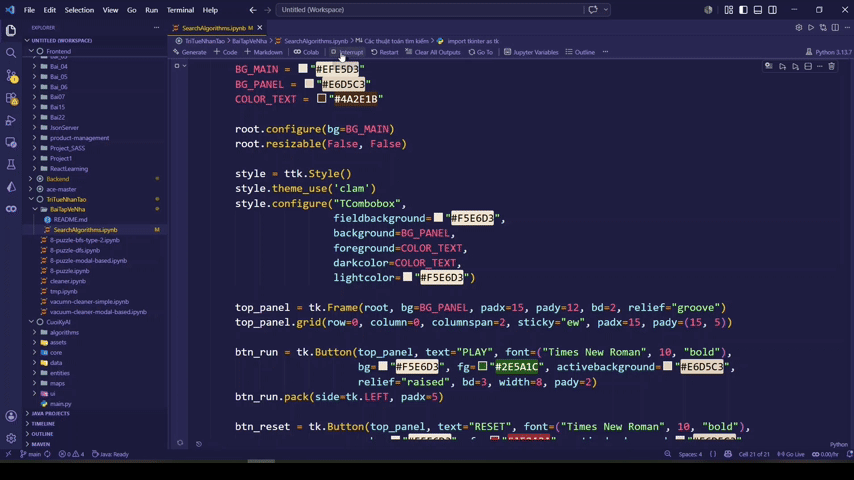

## Demo

## Các thuật toán tìm kiếm được tích hợp

### 1. Uninformed Search Algorithm (Tìm kiếm mù)
Đây là nhóm thuật toán duyệt qua không gian trạng thái một cách hệ thống mà không có bất kỳ thông tin gợi ý nào về vị trí của trạng thái đích (Goal State).

**&nbsp;&nbsp;1.1. Breadth-First Search (BFS - Tìm kiếm theo chiều rộng)**

**&nbsp;&nbsp;1.2. Depth-First Search (DFS - Tìm kiếm theo chiều sâu)**

**&nbsp;&nbsp;1.3. Iterative Deepening Search (IDS - Tìm kiếm sâu dần)**

**&nbsp;&nbsp;1.4. Uniform Cost Search (UCS - Tìm kiếm chi phí đồng nhất)**

### 2. Informed Search Algorithm (Tìm kiếm có thông tin)
Nhóm thuật toán này sử dụng thêm hàm đánh giá (Heuristic function) để ước lượng khoảng cách từ trạng thái hiện tại đến đích, giúp thuật toán dự đoán được hướng đi nào là tiềm năng nhất và ưu tiên duyệt trước.

**&nbsp;&nbsp;2.1. Greedy Search Algorithm (GSA - Tìm kiếm tham lam)**

**&nbsp;&nbsp;2.2. A\* Search Algorithm (Tìm kiếm A\*)**

**&nbsp;&nbsp;2.3. Iterative Deepening A\* (IDA\* - Tìm kiếm A\* sâu dần)**

### 3. Local Search Algorithm (Tìm kiếm cục bộ)
Nhóm thuật toán tìm kiếm cục bộ hoạt động bằng cách cải thiện dần lời giải hiện tại thông qua việc di chuyển sang các trạng thái lân cận có giá trị tốt hơn theo một hàm đánh giá. Thay vì lưu và duyệt toàn bộ cây trạng thái, các thuật toán này chỉ tập trung vào trạng thái hiện tại, giúp tiết kiệm bộ nhớ và phù hợp với các bài toán tối ưu hóa lớn.

**&nbsp;&nbsp;3.1. Hill Climbing Algorithm**

**&nbsp;&nbsp;&nbsp;&nbsp;3.1.1. Simple Hill Climbing**

**&nbsp;&nbsp;&nbsp;&nbsp;3.1.2. Steepest Ascent Hill Climbing**

**&nbsp;&nbsp;&nbsp;&nbsp;3.1.3. Random Hill Climbing**

**&nbsp;&nbsp;&nbsp;&nbsp;3.1.4. Random Reset Hill Climbing**

**&nbsp;&nbsp;3.2. Local Beam Search**

**&nbsp;&nbsp;3.3. Simulated Annealing Algorithm**

### 4. Search in Complex Environments (Tìm kiếm trong môi trường phức tạp)

**&nbsp;&nbsp;4.1. Blind-Environment Search Algorithm**

**&nbsp;&nbsp;&nbsp;&nbsp;4.1.1. Blind-Start Search Algorithm**

**&nbsp;&nbsp;&nbsp;&nbsp;4.1.2. Blind-Goal Search Algorithm**

**&nbsp;&nbsp;4.2. Partial-Environment Search Algorithm**

**&nbsp;&nbsp;4.3. And-Or-Graph Search Algorithm**

### 5. Search with Constraint Satisfaction Problem (Tìm kiếm trong môi trường có ràng buộc)

**&nbsp;&nbsp;5.1. Backtracking**

**&nbsp;&nbsp;5.2. Foward Checking**

## Hướng dẫn chạy chương trình

**Bước 1:** Tải source code về máy và mở file chứa hàm main. Cập nhật biến initial thành trạng thái ban đầu của trò chơi mà bạn muốn giải, sau đó bấm Run All.

**Bước 2:** Sau khi chạy, cửa sổ chương trình sẽ xuất hiện. Chọn thuật toán bạn muốn sử dụng ở thanh menu, sau đó bấm "PLAY" để thuật toán bắt đầu phân tích. Cửa sổ sẽ trực quan hóa từng step giải bài toán. Đồng thời, danh sách các hành động tương ứng để đi từ trạng thái bắt đầu đến trạng thái hiển thị trên màn hình cũng sẽ được cập nhật.

**Bước 3:** Bấm nút "Reset" để xóa các thiết lập hiện tại và đưa ma trận về lại trạng thái khởi tạo ban đầu.

### Lưu ý quan trọng
Sau khi bấm nút "PLAY", thời gian để thuật toán tìm ra lời giải nhanh hay chậm sẽ phụ thuộc rất lớn vào thuật toán bạn lựa chọn và độ khó của trạng thái ban đầu. Hãy chờ đợi nếu chương trình đang xử lý những test case khó.