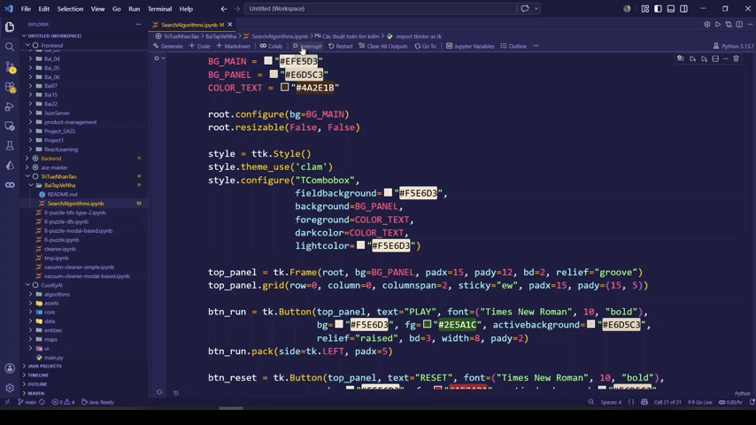

## Demo

## Các thuật toán tìm kiếm được tích hợp

### 1. Uninformed Search Algorithm (Tìm kiếm mù)
Đây là nhóm thuật toán duyệt qua không gian trạng thái một cách hệ thống mà không có bất kỳ thông tin gợi ý nào về cách đến vị trí của trạng thái đích (Goal State).

**&nbsp;&nbsp;1.1. Breadth-First Search (BFS - Tìm kiếm theo chiều rộng):** Duyệt theo từng tầng (hết chứng chỉ này mới học chứng chỉ khác). Dùng hàng đợi (Queue - FIFO). Tìm được đường ngắn nhất nếu các cạnh bằng chi phí, nhưng cực kỳ tốn RAM vì phải lưu lại tất cả các nút ở tầng hiện tại.

**&nbsp;&nbsp;1.2. Depth-First Search (DFS - Tìm kiếm theo chiều sâu):** Đi lún sâu vào một nhánh cho đến khi kịch đường (gặp ngõ cụt) rồi mới quay xe (Backtrack) thử nhánh khác. Dùng ngăn xếp (Stack - LIFO). Tiết kiệm RAM hơn BFS rất nhiều nhưng dễ bị lọt vào vòng lặp vô tận và không đảm bảo tìm được đường tối ưu.

**&nbsp;&nbsp;1.3. Iterative Deepening Search (IDS - Tìm kiếm sâu dần):** Sự kết hợp giữa BFS và DFS. Thuật toán chạy DFS nhưng bị giới hạn độ sâu (Depth Limit). Nếu không tìm thấy đích, nó tăng giới hạn độ sâu lên và chạy lại từ đầu. Vừa tiết kiệm bộ nhớ như DFS, vừa đảm bảo tối ưu như BFS.

**&nbsp;&nbsp;1.4. Uniform Cost Search (UCS - Tìm kiếm chi phí đồng nhất):** Phiên bản nâng cấp của BFS cho đồ thị có trọng số. Thuật toán dùng hàng đợi ưu tiên (Priority Queue) để luôn chọn đi vào nút có tổng chi phí từ gốc đến hiện tại là nhỏ nhất. Đảm bảo tìm được đường đi rẻ nhất trên mọi đồ thị có trọng số dương.

### 2. Informed Search Algorithm (Tìm kiếm có thông tin)
Nhóm thuật toán này sử dụng thêm hàm đánh giá (Heuristic function) để ước lượng khoảng cách từ trạng thái hiện tại đến đích, giúp thuật toán dự đoán được hướng đi nào là tiềm năng nhất và ưu tiên duyệt trước.

**&nbsp;&nbsp;2.1. Greedy Search Algorithm (GSA - Tìm kiếm tham lam):** Tại mỗi bước, thuật toán chỉ chọn nút nào có vẻ gần đích nhất dựa thuần túy vào hàm đánh giá $h(n)$ mà bỏ qua chi phí đã đi. Chạy siêu nhanh nếu Heuristic chuẩn, nhưng dễ bị lừa vào ngõ cụt vì cái gì trước mắt ngon chưa chắc cả con đường đã tối ưu.

**&nbsp;&nbsp;2.2. A\* Search Algorithm (Tìm kiếm A\*):** Thuật toán quốc dân, chọn đường đi dựa trên tổng chi phí tối ưu: $f(n) = g(n) + h(n)$ (với $g(n)$ là chi phí thực tế đã đi từ gốc và $h(n)$ là chi phí ước lượng đường chim bay đến đích). Vừa thực tế vừa có tầm nhìn, tìm được đường tối ưu nhất nếu hàm Heuristic được thiết kế tốt.

**&nbsp;&nbsp;2.3. Iterative Deepening A\* (IDA\* - Tìm kiếm A\* sâu dần):** Giống như IDS, nhưng thay vì giới hạn bằng độ sâu của cây, IDA* sử dụng giá trị $f(n)$ của thuật toán A* làm giới hạn (cut-off). Nếu vượt quá giới hạn chi phí, nó tăng giới hạn lên và lặp lại từ đầu. Giữ được độ tối ưu của A* nhưng tốn ít bộ nhớ hơn nhiều.

### 3. Local Search Algorithm (Tìm kiếm cục bộ)
Nhóm thuật toán tìm kiếm cục bộ hoạt động bằng cách cải thiện dần lời giải hiện tại thông qua việc di chuyển sang các trạng thái lân cận có giá trị tốt hơn theo một hàm đánh giá. Thay vì lưu và duyệt toàn bộ cây trạng thái, các thuật toán này chỉ tập trung vào trạng thái hiện tại, giúp tiết kiệm bộ nhớ và phù hợp với các bài toán tối ưu hóa lớn.

**&nbsp;&nbsp;3.1. Hill Climbing Algorithm**

**&nbsp;&nbsp;&nbsp;&nbsp;3.1.1. Simple Hill Climbing:** Đang đứng ở đâu thì nhìn xung quanh, thấy thằng lân cận đầu tiên nào cao hơn (tốt hơn) trạng thái hiện tại là nhảy sang ngay, không thèm tốn thời gian chọn lọc xem có thằng nào tốt hơn nữa không.

**&nbsp;&nbsp;&nbsp;&nbsp;3.1.2. Steepest Ascent Hill Climbing:** Khó tính hơn Simple, thuật toán phải ngó nghiêng quét hết tất cả các nút xung quanh xem thằng nào "cao nhất/tốt nhất" thì mới chịu bước qua.

**&nbsp;&nbsp;&nbsp;&nbsp;3.1.3. Random Hill Climbing:** Chọn ngẫu nhiên một nút lân cận. Nếu nút đó tốt hơn trạng thái hiện tại thì di chuyển, không thì chọn lại nút khác.

**&nbsp;&nbsp;&nbsp;&nbsp;3.1.4. Random Reset Hill Climbing:** Nếu lỡ leo lên một đỉnh cục bộ (Local Maxima) và bị kẹt không lên được nữa, thuật toán sẽ tự động "hồi sinh" ngẫu nhiên ở một vị trí hoàn toàn mới trên bản đồ để leo lại từ đầu.

**&nbsp;&nbsp;3.2. Local Beam Search:** Thay vì chỉ giữ một trạng thái như Leo đồi, thuật toán này giữ cùng lúc $k$ trạng thái tốt nhất. Ở mỗi bước, nó sinh ra tất cả các trạng thái lân cận của cả $k$ thằng này, rồi lại chọn ra $k$ thằng đỉnh nhất để giữ lại cho bước sau.

**&nbsp;&nbsp;3.3. Simulated Annealing Algorithm:** Lấy ý tưởng từ việc nung nóng kim loại rồi hạ nhiệt từ từ. Ban đầu (nhiệt độ cao), nó sẵn sàng chấp nhận các bước đi tệ hơn (xuống dốc) với một xác suất nhất định để thoát khỏi đỉnh cục bộ. Càng về sau (nhiệt độ giảm), nó càng "nghiêm túc" và chỉ đi lên giống Hill Climbing.

### 4. Search in Complex Environments (Tìm kiếm trong môi trường phức tạp)
Nhóm thuật toán này được thiết kế để xử lý các bài toán trong thế giới thực, nơi môi trường không còn lý tưởng (như thông tin bị che khuất, không rõ ràng hoặc có các yếu tố ngẫu nhiên, đối thủ phá đám). Thay vì giả định mọi thứ đều biết trước và cố định, các thuật toán này phải vừa tìm kiếm, vừa thăm dò và liên tục lập kế hoạch dự phòng để thích ứng với sự thay đổi của môi trường.

**&nbsp;&nbsp;4.1. Blind-Environment Search Algorithm**

**&nbsp;&nbsp;&nbsp;&nbsp;4.1.1. Blind-Start Search Algorithm:** Tìm kiếm khi không biết rõ trạng thái bắt đầu của mình thực sự là gì (ví dụ: bị thả vào mê cung tối om, phải tự đoán hoặc hành động thăm dò để xác định vị trí ban đầu).

**&nbsp;&nbsp;&nbsp;&nbsp;4.1.2. Blind-Goal Search Algorithm:** Đi tìm một cái đích nhưng không có mô tả rõ ràng về hình dáng hay vị trí của đích, chỉ khi nào chạm trúng đích hoặc kích hoạt điều kiện thắng thì mới nhận ra.

**&nbsp;&nbsp;4.2. Partial-Environment Search Algorithm:** Tìm kiếm trong môi trường chỉ quan sát được một phần (kiểu như chơi game có sương mù bản đồ - Fog of War). Thuật toán phải liên tục cập nhật bản đồ dựa trên tầm nhìn hiện tại để ra quyết định tiếp theo.

**&nbsp;&nbsp;4.3. And-Or-Graph Search Algorithm:** Sử dụng cho môi trường không thể dự đoán trước (do thiên tai hoặc đối thủ phá đám). Khi thực hiện một hành động, kết quả có thể rơi vào nhánh A HOẶC nhánh B, đòi hỏi thuật toán phải lên kế hoạch cho mọi tình huống có thể xảy ra (Cây AND-OR).

### 5. Search with Constraint Satisfaction Problem (Tìm kiếm trong môi trường có ràng buộc)
Nhóm thuật toán này được sử dụng cho các bài toán mà mục tiêu không phải là tìm một chuỗi các bước đi, mà là tìm một trạng thái thỏa mãn tất cả các điều kiện (ràng buộc) cho trước (như xếp lịch thi, giải Sudoku, tô màu bản đồ). Thay vì duyệt cây trạng thái một cách vô định, các thuật toán này tập trung vào việc gán giá trị cho các biến và liên tục kiểm tra tính hợp lệ để thu hẹp không gian tìm kiếm một cách thông minh.

**&nbsp;&nbsp;5.1. Backtracking:** Thử đặt một giá trị vào biến hiện tại. Nếu không vi phạm ràng buộc thì đi tiếp sang biến tiếp theo. Nếu đi vào ngõ cụt (không đặt được giá trị nào hợp lệ nữa), thuật toán sẽ "quay xe" lại bước trước đó để đổi giá trị khác (bản chất là DFS cải tiến).

**&nbsp;&nbsp;5.2. Foward Checking:** Phiên bản thông minh hơn của Backtracking. Mỗi khi đặt giá trị cho một biến, nó sẽ lập tức "nhìn về phía trước" và xóa bỏ các giá trị không còn hợp lệ ở các biến chưa được thiết lập. Nếu thấy có biến nào ở tương lai bị cạn sạch lựa chọn, nó lập tức quay lui luôn chứ không rảnh để đi tiếp nữa.

## Hướng dẫn chạy chương trình

**Bước 1:** Tải source code về máy và mở file chứa hàm main. Cập nhật biến initial thành trạng thái ban đầu của trò chơi mà bạn muốn giải, sau đó bấm Run All.

**Bước 2:** Sau khi chạy, cửa sổ chương trình sẽ xuất hiện. Chọn thuật toán bạn muốn sử dụng ở thanh menu, sau đó bấm "PLAY" để thuật toán bắt đầu phân tích. Cửa sổ sẽ trực quan hóa từng step giải bài toán. Đồng thời, danh sách các hành động tương ứng để đi từ trạng thái bắt đầu đến trạng thái hiển thị trên màn hình cũng sẽ được cập nhật.

**Bước 3:** Bấm nút "Reset" để xóa các thiết lập hiện tại và đưa ma trận về lại trạng thái khởi tạo ban đầu.

### Lưu ý quan trọng
Sau khi bấm nút "PLAY", thời gian để thuật toán tìm ra lời giải nhanh hay chậm sẽ phụ thuộc rất lớn vào thuật toán bạn lựa chọn và độ khó của trạng thái ban đầu. Hãy chờ đợi nếu chương trình đang xử lý những test case khó.